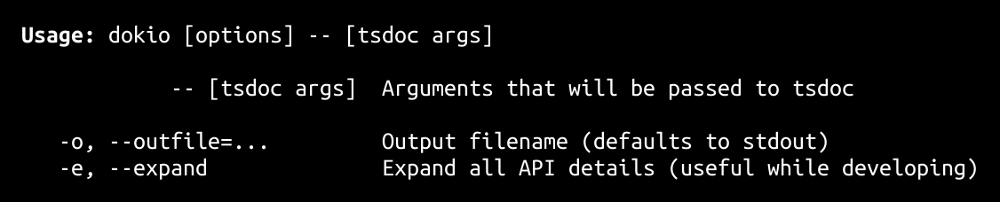

<h1>
dokio   
</h1>

Documentation generator for TypeScript projects.

<h4>
<table><tr><td title="Triple click to select and copy paste">
<code>npm i dokio -g</code>
</td><td title="Triple click to select and copy paste">
<code>pnpm add dokio -g</code>
</td><td title="Triple click to select and copy paste">
<code>yarn global add dokio</code>
</td></tr></table>
</h4>

## CLI

## API

  

<a href="#api$1">#</a>  <code><strong>api</strong></code>    
  <a href="src/api/index.ts#L1">src/api/index.ts#L1</a>  <ul>        
  

<a href="#ExitCodes$2">#</a>  <code><strong>ExitCodes</strong></code>    
  <a href="src/api/produce.ts#L3">src/api/produce.ts#L3</a>  <ul>        
  

<a href="#CompileError$6">#</a>  <code><strong>CompileError</strong></code>  &nbsp;=&nbsp;  <code>3</code>  
  <a href="src/api/produce.ts#L7">src/api/produce.ts#L7</a>  <ul>        </ul>

<a href="#ExceptionThrown$9">#</a>  <code><strong>ExceptionThrown</strong></code>  &nbsp;=&nbsp;  <code>6</code>  
  <a href="src/api/produce.ts#L10">src/api/produce.ts#L10</a>  <ul>        </ul>

<a href="#NoEntryPoints$5">#</a>  <code><strong>NoEntryPoints</strong></code>  &nbsp;=&nbsp;  <code>2</code>  
  <a href="src/api/produce.ts#L6">src/api/produce.ts#L6</a>  <ul>        </ul>

<a href="#Ok$3">#</a>  <code><strong>Ok</strong></code>  &nbsp;=&nbsp;  <code>0</code>  
  <a href="src/api/produce.ts#L4">src/api/produce.ts#L4</a>  <ul>        </ul>

<a href="#OptionError$4">#</a>  <code><strong>OptionError</strong></code>  &nbsp;=&nbsp;  <code>1</code>  
  <a href="src/api/produce.ts#L5">src/api/produce.ts#L5</a>  <ul>        </ul>

<a href="#OutputError$8">#</a>  <code><strong>OutputError</strong></code>  &nbsp;=&nbsp;  <code>5</code>  
  <a href="src/api/produce.ts#L9">src/api/produce.ts#L9</a>  <ul>        </ul>

<a href="#ValidationError$7">#</a>  <code><strong>ValidationError</strong></code>  &nbsp;=&nbsp;  <code>4</code>  
  <a href="src/api/produce.ts#L8">src/api/produce.ts#L8</a>  <ul>        </ul>

</ul>

<a href="#produce$10">#</a>  <code><strong>produce</strong></code><em>()</em>    
  <a href="src/api/produce.ts#L13">src/api/produce.ts#L13</a>  <ul>    
      
<strong>produce</strong><em>()</em>  &nbsp;=&gt;  <ul>Promise&lt;ProjectReflection | <a href="#ExitCodes$2">ExitCodes</a>&gt;</ul>

    </ul>

<a href="#render$12">#</a>  <code><strong>render</strong></code><em>(doc, { expand })</em>    
  <a href="src/api/render.tsx#L299">src/api/render.tsx#L299</a>  <ul>    
    

<a href="#doc$14">#</a>  <code><strong>doc</strong></code>    
    <ul>
ProjectReflection
        </ul>
{
  

<a href="#expand$17">#</a>  <code><strong>expand</strong></code>    
  <a href="src/api/render.tsx#L299">src/api/render.tsx#L299</a>  <ul>
boolean
        </ul>

}  
<strong>render</strong><em>(doc, { expand })</em>  &nbsp;=&gt;  <ul>string</ul>

    </ul>

</ul>

<a href="#bin$18">#</a>  <code><strong>bin</strong></code>    
  <a href="src/bin/index.ts#L1">src/bin/index.ts#L1</a>  <ul>        
  

<a href="#Bin$19">#</a>  <code><strong>Bin</strong></code>    
  <a href="src/bin/produce.ts#L5">src/bin/produce.ts#L5</a>  <ul>
{
  

<a href="#name$21">#</a>  <code><strong>name</strong></code>    
  <a href="src/bin/produce.ts#L6">src/bin/produce.ts#L6</a>  <ul>
string
        </ul>

<a href="#screenshot$22">#</a>  <code><strong>screenshot</strong></code>    
  <a href="src/bin/produce.ts#L7">src/bin/produce.ts#L7</a>  <ul>
string
        </ul>

<a href="#screenshotDimensions$23">#</a>  <code><strong>screenshotDimensions</strong></code>    
  <a href="src/bin/produce.ts#L8">src/bin/produce.ts#L8</a>  <ul>
{
  

<a href="#height$26">#</a>  <code><strong>height</strong></code>    
  <a href="src/bin/produce.ts#L10">src/bin/produce.ts#L10</a>  <ul>
number
        </ul>

<a href="#width$25">#</a>  <code><strong>width</strong></code>    
  <a href="src/bin/produce.ts#L9">src/bin/produce.ts#L9</a>  <ul>
number
        </ul>

}
        </ul>

}
        </ul>

<a href="#produce$27">#</a>  <code><strong>produce</strong></code><em>()</em>    
  <a href="src/bin/produce.ts#L14">src/bin/produce.ts#L14</a>  <ul>    
      
<strong>produce</strong><em>()</em>  &nbsp;=&gt;  <ul>Promise&lt;Partial&lt;<a href="#Bin$19">Bin</a>&gt;&gt;</ul>

    </ul>

<a href="#render$29">#</a>  <code><strong>render</strong></code><em>(<a href="#Bin$19">Bin</a>)</em>    
  <a href="src/bin/render.tsx#L5">src/bin/render.tsx#L5</a>  <ul>    
    <a href="#Bin$19">Bin</a>  
<strong>render</strong><em>(<a href="#Bin$19">Bin</a>)</em>  &nbsp;=&gt;  <ul>string</ul>

    </ul>

</ul>

<a href="#examples$32">#</a>  <code><strong>examples</strong></code>    
  <a href="src/examples/index.ts#L1">src/examples/index.ts#L1</a>  <ul>        
  

<a href="#ExampleFile$33">#</a>  <code><strong>ExampleFile</strong></code>    
  <a href="src/examples/produce.ts#L9">src/examples/produce.ts#L9</a>  <ul>
{
  

<a href="#contents$44">#</a>  <code><strong>contents</strong></code>    
  <a href="src/examples/produce.ts#L19">src/examples/produce.ts#L19</a>  <ul>
string
        </ul>

<a href="#fileName$36">#</a>  <code><strong>fileName</strong></code>    
  <a href="src/examples/produce.ts#L11">src/examples/produce.ts#L11</a>  <ul>
string
        </ul>

<a href="#lang$37">#</a>  <code><strong>lang</strong></code>    
  <a href="src/examples/produce.ts#L12">src/examples/produce.ts#L12</a>  <ul>
string
        </ul>

<a href="#link$43">#</a>  <code><strong>link</strong></code>    
  <a href="src/examples/produce.ts#L18">src/examples/produce.ts#L18</a>  <ul>
string
        </ul>

<a href="#name$35">#</a>  <code><strong>name</strong></code>    
  <a href="src/examples/produce.ts#L10">src/examples/produce.ts#L10</a>  <ul>
string
        </ul>

<a href="#screenshot$38">#</a>  <code><strong>screenshot</strong></code>    
  <a href="src/examples/produce.ts#L13">src/examples/produce.ts#L13</a>  <ul>
string
        </ul>

<a href="#screenshotDimensions$39">#</a>  <code><strong>screenshotDimensions</strong></code>    
  <a href="src/examples/produce.ts#L14">src/examples/produce.ts#L14</a>  <ul>
{
  

<a href="#height$42">#</a>  <code><strong>height</strong></code>    
  <a href="src/examples/produce.ts#L16">src/examples/produce.ts#L16</a>  <ul>
number
        </ul>

<a href="#width$41">#</a>  <code><strong>width</strong></code>    
  <a href="src/examples/produce.ts#L15">src/examples/produce.ts#L15</a>  <ul>
number
        </ul>

}
        </ul>

}
        </ul>

<a href="#produce$45">#</a>  <code><strong>produce</strong></code><em>()</em>    
  <a href="src/examples/produce.ts#L22">src/examples/produce.ts#L22</a>  <ul>    
      
<strong>produce</strong><em>()</em>  &nbsp;=&gt;  <ul>Promise&lt;<a href="#ExampleFile$33">ExampleFile</a>  []&gt;</ul>

    </ul>

<a href="#render$47">#</a>  <code><strong>render</strong></code><em>(examples)</em>    
  <a href="src/examples/render.tsx#L79">src/examples/render.tsx#L79</a>  <ul>    
    

<a href="#examples$49">#</a>  <code><strong>examples</strong></code>    
    <ul>
<a href="#ExampleFile$33">ExampleFile</a>  []
        </ul>
  
<strong>render</strong><em>(examples)</em>  &nbsp;=&gt;  <ul>string</ul>

    </ul>

</ul>

<a href="#footer$50">#</a>  <code><strong>footer</strong></code>    
  <a href="src/footer/index.ts#L1">src/footer/index.ts#L1</a>  <ul>        
  

<a href="#Footer$51">#</a>  <code><strong>Footer</strong></code>    
  <a href="src/footer/produce.ts#L5">src/footer/produce.ts#L5</a>  <ul>
{
  

<a href="#deps$53">#</a>  <code><strong>deps</strong></code>    
  <a href="src/footer/produce.ts#L6">src/footer/produce.ts#L6</a>  <ul>
normalize.Package  []
        </ul>

<a href="#pkg$54">#</a>  <code><strong>pkg</strong></code>    
  <a href="src/footer/produce.ts#L7">src/footer/produce.ts#L7</a>  <ul>
normalize.Package &amp; {
  

<a href="#short$56">#</a>  <code><strong>short</strong></code>    
  <a href="src/footer/produce.ts#L7">src/footer/produce.ts#L7</a>  <ul>
string
        </ul>

}
        </ul>

}
        </ul>

<a href="#produce$57">#</a>  <code><strong>produce</strong></code><em>()</em>    
  <a href="src/footer/produce.ts#L10">src/footer/produce.ts#L10</a>  <ul>    
      
<strong>produce</strong><em>()</em>  &nbsp;=&gt;  <ul>Promise&lt;{
  

<a href="#deps$60">#</a>  <code><strong>deps</strong></code>    
    <ul>
any  []
        </ul>

<a href="#pkg$61">#</a>  <code><strong>pkg</strong></code>    
    <ul>
any
        </ul>

}&gt;</ul>

    </ul>

<a href="#render$62">#</a>  <code><strong>render</strong></code><em>(<a href="#Footer$51">Footer</a>)</em>    
  <a href="src/footer/render.tsx#L18">src/footer/render.tsx#L18</a>  <ul>    
    <a href="#Footer$51">Footer</a>  
<strong>render</strong><em>(<a href="#Footer$51">Footer</a>)</em>  &nbsp;=&gt;  <ul>string</ul>

    </ul>

</ul>

<a href="#header$65">#</a>  <code><strong>header</strong></code>    
  <a href="src/header/index.ts#L1">src/header/index.ts#L1</a>  <ul>        
  

<a href="#Header$66">#</a>  <code><strong>Header</strong></code>    
  <a href="src/header/produce.ts#L7">src/header/produce.ts#L7</a>  <ul>
{
  

<a href="#brotli$68">#</a>  <code><strong>brotli</strong></code>    
  <a href="src/header/produce.ts#L8">src/header/produce.ts#L8</a>  <ul>
number
        </ul>

<a href="#loc$70">#</a>  <code><strong>loc</strong></code>    
  <a href="src/header/produce.ts#L10">src/header/produce.ts#L10</a>  <ul>
any
        </ul>

<a href="#pkg$69">#</a>  <code><strong>pkg</strong></code>    
  <a href="src/header/produce.ts#L9">src/header/produce.ts#L9</a>  <ul>
normalize.Package
        </ul>

}
        </ul>

<a href="#produce$71">#</a>  <code><strong>produce</strong></code><em>()</em>    
  <a href="src/header/produce.ts#L13">src/header/produce.ts#L13</a>  <ul>    
      
<strong>produce</strong><em>()</em>  &nbsp;=&gt;  <ul>Promise&lt;<a href="#Header$66">Header</a>&gt;</ul>

    </ul>

<a href="#render$73">#</a>  <code><strong>render</strong></code><em>(<a href="#Header$66">Header</a>)</em>    
  <a href="src/header/render.tsx#L6">src/header/render.tsx#L6</a>  <ul>    
    <a href="#Header$66">Header</a>  
<strong>render</strong><em>(<a href="#Header$66">Header</a>)</em>  &nbsp;=&gt;  <ul>string</ul>

    </ul>

</ul>

<a href="#intro$76">#</a>  <code><strong>intro</strong></code>    
  <a href="src/intro/index.ts#L1">src/intro/index.ts#L1</a>  <ul>        
  

<a href="#Intro$77">#</a>  <code><strong>Intro</strong></code>    
  <a href="src/intro/produce.ts#L4">src/intro/produce.ts#L4</a>  <ul>
{
  

<a href="#intro$79">#</a>  <code><strong>intro</strong></code>    
  <a href="src/intro/produce.ts#L5">src/intro/produce.ts#L5</a>  <ul>
string
        </ul>

}
        </ul>

<a href="#produce$80">#</a>  <code><strong>produce</strong></code><em>()</em>    
  <a href="src/intro/produce.ts#L8">src/intro/produce.ts#L8</a>  <ul>    
      
<strong>produce</strong><em>()</em>  &nbsp;=&gt;  <ul>Promise&lt;<a href="#Intro$77">Intro</a>&gt;</ul>

    </ul>

<a href="#render$82">#</a>  <code><strong>render</strong></code><em>(<a href="#Intro$77">Intro</a>)</em>    
  <a href="src/intro/render.ts#L4">src/intro/render.ts#L4</a>  <ul>    
    <a href="#Intro$77">Intro</a>  
<strong>render</strong><em>(<a href="#Intro$77">Intro</a>)</em>  &nbsp;=&gt;  <ul>string</ul>

    </ul>

</ul>

## Credits

- [brotli-size](https://npmjs.org/package/brotli-size) by [Erwin Mombay](https://github.com/erwinmombay) &ndash; Get the brotli compressed size of a string or buffer
- [decarg](https://npmjs.org/package/decarg) by [stagas](https://github.com/stagas) &ndash; decorator based cli arguments parser
- [get-video-width-height](https://npmjs.org/package/get-video-width-height) by [clearisoft](https://github.com/clearisoft) &ndash; Get the width and height of a video
- [html-jsx](https://npmjs.org/package/html-jsx) by [stagas](https://github.com/stagas) &ndash; Extensible jsx type definitions for standard html interfaces.
- [image-size](https://npmjs.org/package/image-size) by [netroy](http://netroy.in/) &ndash; get dimensions of any image file
- [markdown-it](https://npmjs.org/package/markdown-it) by [markdown-it](https://github.com/markdown-it) &ndash; Markdown-it - modern pluggable markdown parser.
- [normalize-package-data](https://npmjs.org/package/normalize-package-data) by [GitHub Inc.](https://github.com/npm) &ndash; Normalizes data that can be found in package.json files.
- [typedoc](https://npmjs.org/package/typedoc) by [TypeStrong](https://github.com/TypeStrong) &ndash; Create api documentation for TypeScript projects.
- [typedoc-plugin-missing-exports](https://npmjs.org/package/typedoc-plugin-missing-exports) by [Gerrit Birkeland](https://github.com/Gerrit0) &ndash; Include non-exported types in TypeDoc documentation

## Contributing

[Fork](https://github.com/stagas/dokio/fork) or [edit](https://github.dev/stagas/dokio) and submit a PR.

All contributions are welcome!

## License

<a href="LICENSE">MIT</a> &copy; 2022 [stagas](https://github.com/stagas)
